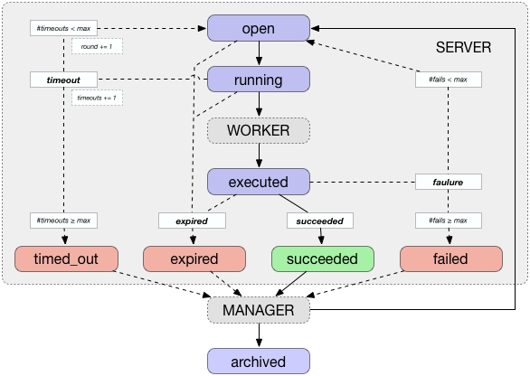

# TDF - Task Distribution Framework

## States of a task

During its lifetime, a task can have various states, always starting from **open** and ending as **archived**.
In between, a task can have various states.
The transitions between these states are executed by the three components: *server*, *worker*, and *manager*.
In the following, we describe the **main** and **intermediate** states of a task as well as all **transitions** between these states.

### Main states of a task

	. . . . . .  . . . . . . .
	. open  ->  running  ->  executed  ->  archived
	. . . . . .  . . . . . . .

In the regular workflow, each task goes through four main states: open, running, executed, and archived.
A new task is always created in the initial state **open**.
While a task is processed, it resides in the state **running** and is moved to the state **executed** after completion.
Finally, the task's state is changed to **archived** after processing it.

### Intermediate states of a task

	. . . . . .  . . . . . . .
	. timed_out  |  expired  |  succeeded  |  failed
	. . . . . .  . . . . . . .

In addition to the main states, a task can reside in one of four intermediate states: succeeded, failed, timed out, or expired.
A task is **succeeded** if it was executed successfully and on time, i.e., it was marked executed before its configured `end_before` timestamp.
A task is **failed** if its last execution failed.
A task is **timed out** after being in the **running** state longer than the configured `timeout` time.
A task is expired if its configured `end_before` timestamp lies in the past.

### Transitions between states

Each task has the state **open** after creation and **archived** after fully processing it.
In between, various transitions between the main and intermediate states are possible, depending on its properties and the success of executing a task (on time).
In the following, we describe all possible transitions from each state into another.
We denote the component that initiates the transition as `[component]`.

It can happen that a components wants to execute such a transition but the task is not in the source state any more.
In this case, an error is given and no action is performed.
This can happen for any state that multiple components can process.
For example, a running task that is marked as timed_out or expired by the server cannot be marked as executed by the worker any more.
In this case, the worker drops the task and does not process it further.

	open  ->  running  [worker]
An open task is marked as **running** by the worker that processes it.
In the current version, only a single task should be assigned to a worker.

	running  ->  timed_out  [server]
A running task is considered to be timed out, if it was longer in the state running than indicated by its configured property `timeout`.
If that happens, its `timeout` counter is incremented.
If this counter exceeds the configured maximum number of timeouts (`max_timeouts`), the task is marked as **timed_out**.

	running  ->  open  [server]
A timed out task is re-opened (moved to the state **open**) if it is timed out but the current timeout counter does not exceep the maximum value.

	running  ->  executed  [worker]
After executing a task, the worker changes its state to **executed**.
While doing so, it attaches the results obtained during execution to the task for further processing.

	open | running | executed  ->  expired  [server]
An open, running, or executed task is marked as **expired** by the server if the execution was not finished before the latest execution time configured in the task property `end_before`.

	executed  ->  succeeded  [server]
An executed task is marked as **succeeded** if  it is not expired (`end_before`) and no error occurred during execution.

	executed  ->  failed  [server]
An executed task is marked as **failed** if it is not expired (`end_before`), an error occurred during execution, and it has in total failed too often (`max_fails`).

	executed  ->  open  [server]
An executed task is re-opened (marked as **open**) if it is not expired (`end_before`), an error occurred during execution, and it did not exceed the total failure count (`max_fails`).

	timed_out | expired | succeeded | failed  ->  archived  [manager]
Every timed_out, expired, succeeded, or failed task is processed by the manager and marked as **archived** afterwards.

### Rounds of processing a task

Every time a task is re-opened, a new round starts.
A task is re-opened either after failing (but not too often) or after timing out during execution (but not too often).
Each round is identified by an index, starting at `0`.
A task that is processed without any problems (`open -> running -> executed -> succeeded -> archived`) is in the first round the whole time.
Hence, the round index indicates how many times a task failed or timed out, i.e., `round := failures + timeouts`.

## Attributes and properties of a task

Each task is described by certain attributes which influence the way it is processed by the three components of TDF: server, worker, and manager.
During execution, statistics are maintained and (intermediate) results are stored.

### Task definition

At the highest level, a task is described as a triple `(program, source, input)` where `program` is the name of the program to execute, source describes how it can be obtained, and `input` specifies the input used for the execution of this task.

- `program` (string)
- `source`(string)
- `input` (string)

### Identification

Each task is identified by a unique identifier `id` which is automatically assigned during creation.

- `id` (int)

### Configuration

The following two attributes define the time when a task should be processed:

- `start_after` (float)
- `end_before` (float)

For each task, `start_after` denotes the earliest time when it should be executed, i.e., the earliest point in time when the task can be moved to the state **running**.
Similarly, `end_before` denote the latest time when the execution of a task must be finished.
It is used to determine when a task is expired and change its state accordingly.
Both timestamps are denoted as the unix timestamp (in seconds) where the positions after the decimal point denote miliseconds.

In addition, the maximum number of fails and timeouts can be configured:

- `max_fails` (int)
- `max_timeouts` (int)

These values are used to determine how many times to re-open a timed out or unsuccessful task.

### Recorded characteristics

The following characteristics are recorded / maintained for each task during its whole lifetime:

- `state` (string)
- `round` (int)
- `fails` (int)
- `timeouts` (int)
- `log` (string)

`state` denotes the current state of the task and `round` the index of the current round.
The total number of tails and timeouts (so far) are stored as `fails` and `timeouts`.
Each transition and action performed for / with a task is written into its `log` property.

### Per-round results

For each round, the timestamp of the transition to each state is stored as `$round:$state`, e.g., *3:running* denotes the timestamp when the task was moved to the running state in the fourth round.

- `$round:$state` (float)

The results of each execution of a task (at most one per round) are stored in the coprresponding properties:

- `$round:output` (string)
- `$round:error` (string)

Note that `$round:output` is simply the output of the executed program on stdout while `$round:error` stores the program's output on stderr.
The execution of a task is considered to be **failed** in case `$round:error` is not empty and **succeeded** otherwise.

## Components

TDF consists of three components: server, worker, and manager.

### Server

The server hosts all tasks and automatically manages certain transitions between their states:
it processes executed tasks but also checks open and running tasks.

### Worker

The worker actually executes a tasks and stores the results.
While there is only a single server, there can be arbitrarily many workers that process the tasks hosted by a single server.
A worker claims open tasks (one at a time) and stores the results of its execution, i.e., it performs the following transitions:

	open  ->  running  ->  executed

In case a task times our during execution, a worker can also mark it as timed_out or re-open it.
In case the sever marks a running task as timed_out or expired during execution, the worker simply drops the task after execution.

### Manager

The manager creates new tasks and processes executed ones.
It must be implemented for each project using the provided APIs of the manager.

## Program definition

The definition of a program consists of two parts: its name (`program`) and how to obtain it (`source`).
The name defines the local path where the program is stored / expected, e.g., `my-program/`.

Currently, two ways of obtaining a program are supported: downloading it via http / https or fetching it via rsync.
In both cases, the definition is expected to point to a `run.sh` script or an archive of one of the following formats:

- .tar
- .tar.gz
- .tar.bz
- .tar.bz2
- .zip

Such an archive can contain any number and type of files / directories.
It must contain a script `run.sh` at the top level (!!!keep in mind to make it executable!!!).
If the directory `<name of the program>` does not exist, a worker creates the directory, attempts to download the archive, and unpacks the archive in this directory.
Then, it attempts to execute the following command:

	cd $program/; ./run.sh $input

Here, `$input` is the input defined for this task.
If any of these steps fail, a corresponding error message is output and stored for the task.
Then, the execution is terminated.

### http / https

Getting a program via wget requires the provision of a url (either starting with `http://` or `https://`).

	examples:
		program ; http://bla.fasel/program-v1.zip           ->  program/
		newer ; https://bla.fasel/program-v2.tar            ->  newer/
		crawler-1.1.23 ; http://bla.fasel/crawler-1.tar.gz  ->  crawler-1.1.23/
		crawler-1.2.1 ; http://bla.fasel/crawler--2.tar.gz  ->  crawler-1.2.1/
		blafasel ; http://bla.fasel/run.sh                  ->  blafasel/

### rsync

Getting a program via rsync requires the provision of a valid path (either local or remote).

	examples:
		program ; rsync:bla.fasel:program-v1.zip            ->  program/
		newer ; rsync:bla.fasel:program-v2.tar              ->  newer/
		crawler-1.1.23 ; rsync:/local/crawler-1.tar.gz      ->  crawler-1.1.23/
		crawler-1.2.1 ; rsync:also-local/crawler--2.tar.gz  ->  crawler-1.2.1/
		blafasel ; rsync:also-local/fasel/bla/run.sh        ->  blafasel/

### Usage of `run.sh`

As (regular) output of an execution, a worker stores the stdout.
It considers all output written to stderr as errors.
Hence, a task that outputs anything on stderr is considered as failed and succeeded by TDF otherwise.

## Implementation

For the storage of tasks, lists, and results, we use a [redis server](http://redis.io) is used.
Server, worker, and manager are implemented in Python 2.7.
They communicate with / via the redis server using the [redis-py](https://github.com/andymccurdy/redis-py) library ([doc](https://redis-py.readthedocs.io/en/latest/)).

### Execution

To execute server or worker, we provide the corrsponding scripts: `worker.py` and `server.py`.
They can be found in [src/](src/).
Both expect two arguments:

1. the name of the corresponding instance
1. the path to the corresponbding config file

The manager must be implemented for each program.
Examples are provided in [examples/](examples/).

Examples of their execution are:

	./server.sh server server.cfg
	./worker.py worker-A worker.cfg
	./worker.py worker-34 worker.cfg
	./worker.py worker-156.3.1.38 worker.cfg

Note that the worker's name should be unique for that worker instance.

### Configuration

Each of the three components requires the provision of a specific configuration: `server.cfg`, `worker.cfg`, and `manager.cfg`.
All of them must contains a definition of the redis server to use as well as the namespace to read from / write to.

	[redis]
	host=__host name or IP address__
	port=__redis port (efault: 6379)__
	password=__password configured for redis server ('None' if no password is set)__
	db=__index of the database to use (default: 0)__
	
	[tdf]
	namespace=__namespace to use (e.g., MyProject)__

In addition, each configuration file must provide type-specific entries, described in the following.

#### Server: `server.cfg`

	[server]
	round_duration=1.3

The `round_duration` defines the duration of each round of processing open, running, and executed tasks.
If the time of processing all these lists is below this duration, the server waits the remaining time.

#### Worker: `worker.cfg`

	[worker]
	task_output_filename=results/$worker-$taskId-$round.out
	task_error_filename=results/$worker-$taskId-$round.err
	sleep_after_success=0.1
	sleep_after_failure=0.5
	sleep_after_no_process_claimed=2.0

#### Manager: `manager.cfg`

The `round_duration` defines the duration of each round of processing timed_out, expired, succeeded, and failed tasks.
If the time of processing all these lists is below this duration, the manager waits the remaining time.

	[manager]
	round_duration=1.3

The API of the manager components only requires the specification of a program definition and an input to open a new task.
In case any of the following properties is not defined, the default values, defined in the config file, are used:

	[task_defaults]
	start_after=0
	end_before=inf
	timeout=inf
	max_fails=0
	max_timeouts=0
	add_random_start_offset=False

If `add_random_start_offset` is set to `true`, a random offset in milieconds is set to the (specified) `start_after` timestamp.
This provides a randomization of the execution order of tasks opened with the exact same start time.

## Requirements

To use TDF, a **redis server** must be installed and be reachable from the machine where the server and workers are running.

TDF requires **Python version 2.7**.
The packages **redis** and **subprocess32** must be installed.

The following programs must be available as well: **rsync** and **wget**.

## Example

Some examples of TDF's use are provided in [examples/](examples/).

